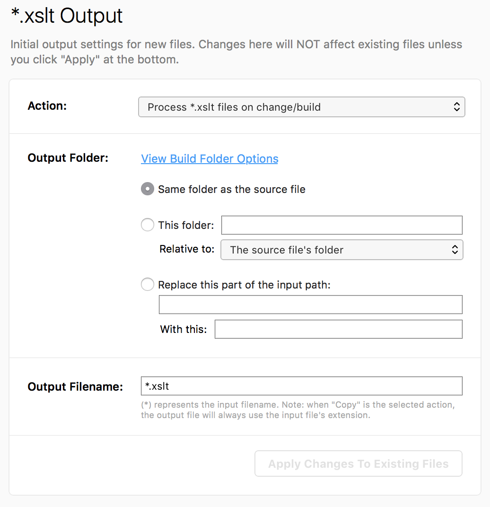

# XSLT Lint

So [CodeKit 3](https://codekitapp.com) was just released and the Hooks feature is now perfect
for me to try this something I'd contemplated for some time now...

Basically, I'll use XSLT to process an XSLT stylesheet when it's saved, just to find some of the most basic
errors that pops up, from time to time. E.g., managing to save a non-well-formed file (it happens) or writing
a clever thing where you use `call-template` to render something and then when you went to write the template,
you used your *match* template snippet instead.

This initial linter catches some of those things.

(Note: The well-formedness error is actually caught by the XML parser when it tries to load the stylesheet.
Just so you don't waste a lot of time digging for that :-)

## CodeKit Hooks setup

Here's the Bash script I whipped together for this:

```bash
msg=$(xsltproc --xinclude $PATH_TO_XSLT_LINT_FILE $CK_INPUT_PATH)
if [[ "" = "$msg" ]]; then
	exit 0
else
	echo $msg >&2
	exit 1
fi
```

*Note: You'll need to replace `$PATH_TO_XSLT_LINT_FILE` with the full path to the `XSLTLint.xslt` file, wherever you chose to install it (mine's in `~/Development/lib/` somewhere...)*

It's set up as a *Shell Script* hook to execute when a file is processed and its `Filename` `Ends With` **.xslt**

## CodeKit Languages setup

You also need to configure XSLT as one of the "Other" languages in CodeKit, so
CodeKit knows that if an XSLT file is saved, it should be processed somehow. I've set it up like this:




## WIP

This is a work in progress, obviously - let me know if you have any questions!

Chriztian Steinmeier, October 2016.
